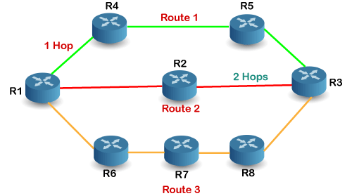

# CCN

`    `**COMPUTER & COMMUNICATION NETWORK**
**

`                         PROJECT REPORT

**GROUP-07**

**ANAND THAKUR(S20200010016)**

**RAHUL RAJ(S20200020296)**

**TANMAY PAWAR(S20200020206)**

**SHIVA RAMAKRISHNA(S20200010120)**

`      `**RIP(ROUTING INFORMATION PROTOCOL)**

The **Routing Information Protocol** (**RIP**) is one of the oldest distance-vector routing protocols which employs the hop count as a routing metric. RIP prevents routing loops by implementing a limit on the number of **hops** allowed in a path from source to destination. The largest number of hops allowed for RIP is 15, which limits the size of networks that RIP can support.

**HOP COUNT**:-Hop count is the number of routers occurring in between the source and destination network.

- RIP follows the Bellman-Ford Algorithm.
- RIP is an intra-domain routing protocol used within an autonomous system.
- The CPU utilization is very less in case of Routing information protocol.

**FUNCTIONING OF RIP:-**

In Above example there are 8 routers in a network where Router 1 wants to send the data to Router 3. If the network is configured with RIP, it will choose the route which has the least number of hops. There are three routes in the above network, i.e., Route 1, Route 2, and Route 3. Route 2 contains the least number of hops, i.e.2 where Route 1 contains 3 hops, and Route 3 contains 4 hops, so RIP will choose Route 2.

`       `**Traffic sent comparison on small mesh Topology**

The figure above shows the router traffic sent in bits/sec in three protocols using single mesh topology. From the graph, the first peak is the initial traffic, the next peak is link failure and the last peak is the link recovery in the network. We can tell OSPF generates the highest

initial traffic since the OSPF will map out the network which requires routers to distribute a 18 large amount of information then choose a path. In addition, we note that EIGRP has the highest bandwidth efficiency, and the second one is OSPF. However, the RIP has the lowest bandwidth efficiency. In this graph, the RIP shows a little difference from OSPF and EIGRP because RIP will update the routing table every 30 seconds, which is the same as our result.

**IMPLEMENTATION SCENARIO,PLATFORM AND METHODOLOGY**

- We generated a .tcl file by making the node topology of RIP. After generating the .tcl file we use some functions like cost for giving cost to each node.
- After that we wrote code for Throughput and Latency in .awk format.
- We also wrote code for Packet processing ratio in .awk format.
- Finally we find the end to end delay by writing code in .awk format.

- ` `All Implementation have been done in NS2 only

- We use Bellman-Ford algorithm for RIP as it is a distance vector algorithm. 

` `**Screenshots of Topology,Trace file & Output**

**(i)Topology**

Aspose.Words.47a15871-93c9-4492-992d-6d2610f7946a.004.png

**(ii)Trace Route**

**(iii)Output** 

**Observations and challenges**

- We observed the values of latency,throughput,packet processing ratio and end to end delay
- The challenges that we faced during making this project was that we didn't have much idea of working on NS2 so first we learned how to use NS2 then we learned about generating tcl files and traceroute by making node topology.
- We also faced challenges during the coding part of end to end delay.
